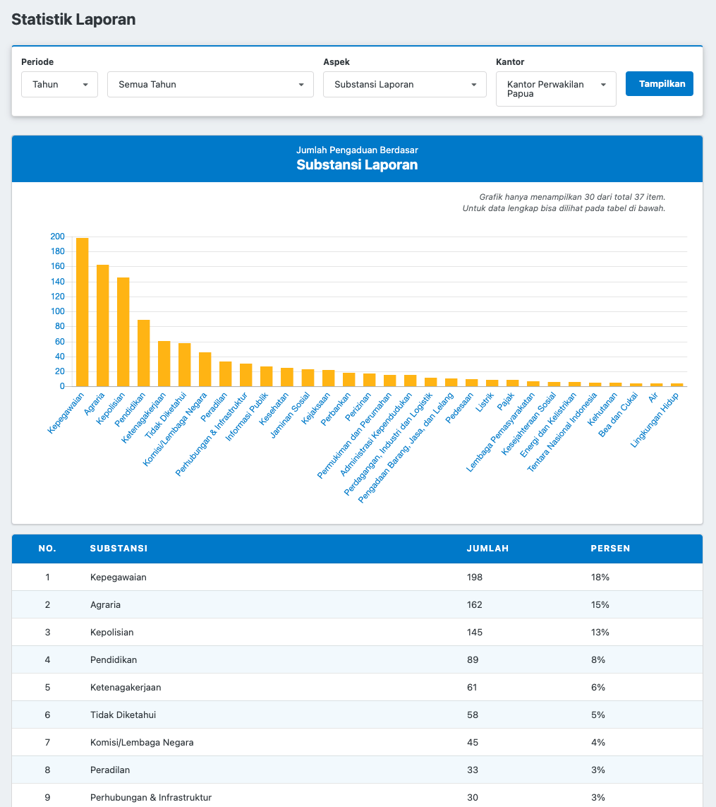

# VIEW
View sering dianaktirikan ketika sedang koding karena biasanya disini kita akan lebih banyak menulis _tag_ HTML dibanding  _real code_. Ketika membahas _clean code_, biasanya contoh yang disertakan selalu dalam bentuk  kode PHP. Jarang sekali dibahas tentang View. Mungkin karena View bukan "PHP", tidak ada _logic_, dan jarang dijadikan tolak ukur kemampuan seorang programmer ketika *interview*.

Jika kamu baru belajar Laravel, besar kemungkinan posisimu saat ini adalah "*fullstack*" web developer. Secara sederhana, "*fullstack*" berarti kamu bisa membuat sebuah aplikasi web secara mandiri mulai dari desain basis data, melakukan query SQL, koding *logic* aplikasi di Laravel, hingga membuat tampilan dengan HTML, CSS, dan Javascript. 

Jika dibawa ke lingkup Laravel, berarti kamu harus mahir dalam membuat Model (interaksi dengan basisdata), View (tampilan), dan Controller (*logic* aplikasi). Setelah menguasai ketiga elemen itu, kamu bisa mendeklarasikan diri <del>sebagai avatar</del> telah menguasai MVC.

Nah, karena saat ini kamu masih harus berhubungan dengan View, maka posisinya harus kita setarakan dengan yang lain. Sebuah View yang clean sama pentingnya dengan Controller dan Model yang clean. Bahkan View harusnya bisa lebih diprioritaskan karena "membersihkan" View jauh lebih mudah dilakukan dibanding membersihkan Controller atau Model.

> Ketika kerja tim, dimana ada senior dan junior programmer, biasanya sang senior (orang yang punya wewenang mereviu kode) lebih mentoleransi View yang tidak rapi dibanding dibanding Controller atau Model. Kita harus mengubah pembiaraan ini. Semua aspek MVC sama pentingnya. View juga bagian dari kode, dia berhak mendapatkan perlakuan yang sama baiknya darimu.

## Memecah File
Salah satu kemampuan yang harus dikuasai untuk menulis kode yang _friendly_ adalah keberanian untuk memecah kode atau _file_. 

Di awal proyek, semua masih terlihat rapi. Kodenya masih sedikit. Seiring berjalannya waktu, ada penambahan fitur disana-sini, tambal sulam bug di kanan dan di kiri. Kode yang awalnya masih terlihat dalam satu layar sekarang harus di-_scroll_ berkali-kali untuk melihat keseluruhan isinya.

Programmer yang baik tahu kapan harus mulai memecah file ketika jumlah barisnya sudah mulai membengkak dan berpotensi susah dikelola dikemudian hari.

## Biasakan Memakai Sub View

Kita ambil contoh halaman dashboard berikut ini.


Pada umumnya, tampilan di atas akan diimplementasi menjadi file blade seperti ini:

```html
@extends('layout')

@section('content')
    
    <h1>Statistik Laporan</h1>
    
    <section>
        Filter
        ...
        ...
    </section>
    
    <section>
        Grafik
        ...
        ...
    </section>
    
    <section>
        Tabel
        ...
        ...
    </section>
    
@endsection
```
Sekarang mari kita coba untuk memecahnya menjadi _sub view_. Bagaimana caranya?

Secara kasat mata, kita bisa melihat ada tiga komponen utama yang menyusun halaman dashboard di atas:
1. Filter
2. Grafik
3. Tabel

Setelah mengetahui komponen penyusun halaman dashboard tersebut ada tiga, maka langkah berikutnya adalah membuat _**sub view**_ untuk masing-masing komponen tersebut. Setelah itu, kita cukup memanggil _**@include**_ dari view utama.

```php
@extends('layout')

@section('content')
    
    <h1>Statistik Laporan</h1>
    
    @include('_filter')
    @include('_grafik')
    @include('_tabel')
    
@endsection
```
**Sederhana dan sangat mudah dilakukan bukan?**

> Kode yang baik adalah kode yang mencerminkan kebutuhan fungsional aplikasinya. Maksudnya adalah ketika kita bilang ada a, b, dan c di aplikasi, maka a, b, dan c itu juga idealnya terlihat secara eksplisit di kode penyusun aplikasi, entah itu sebagai nama file, nama fungsi, atau nama Class. 
>

## Penamaan Sub View
Kamu mungkin bertanya kenapa file blade pada contoh sebelumnya diberi nama `_filter.blade.php` dan bukan `filter.blade.php` saja. Jawabannya juga sangat sederhana: file yang diawali _underscore_ menandakan bahwa file tersebut adalah sub view.

Dengan menambahkan _underscore_ sebagai prefix, maka kita bisa melihat dengan jelas mana kelompok file yang merupakan view utama dan mana file yang merupakan sub view.

//TODO gambar perbandingan underscore vs normal

## Layout vs Konten
Setelah paham cara memecah view agar tidak membengkak, selanjutnya kita perlu paham **kapan** dan **dimana** sebuah view harus dipecah. Terkadang <del>gambar</del> kode bisa menggantikan 1000 kata, jadi mari kita lihat contoh saja.


//TODO: gambar layout implisit

//TODO: gambar layout eksplisit

Dengan memindahkan tag HTML untuk layouting di view utama, kamu bisa mengganti susunan layout dengan sangat mudah. Cukup mengubah view utamanya saja. Sub view tidak perlu diubah.

> :bulb: **View utama untuk mengatur layout, subview untuk merender konten**. Ketika melihat view utama, pastikan kamu bisa membayangkan bagaimana layout halamannya.


## Tidak Mencampur Blok Kode Blade dan JS
Pemakaian editor atau IDE sudah menjadi hal yang wajar bagi programmer saat ini. Setiap keyword, setiap bahasa pemrograman bisa kamu atur _syxtax higlighting_-nya untuk memudahkan mengenali kode.

//TODO gambar syntax higlighting bisa mengenali error

Mencampur kode PHP dan Javascript (berlaku juga untuk bahasa lain) akan mengurangi readability (seberapa mudah kode dibaca/dipahami) dan kemampuan editor/IDE untuk menganalisis kode.

//TODO gambar contoh kode blade + JS campur

Ketika kebutuhan aplikasi mengharuskan adanya "interaksi" antara kode Blade(PHP) dan Javascript, misalnya variable Javascript yang berasal dari variable PHP, ada dua cara yang bisa dilakukan:
1. Passing sebagai data-attribute
2. Definisikan _dynamic variable_ di awal kode

### Passing Variable Sebagai `data-attribute`

// TODO contoh kode

Dengan metode penulisan seperti di atas, kita bisa meminimalisir adanya _**kode oplosan**_, yaitu suatu kondisi bercampurnya 2 bahasa dalam **satu baris kode**.

Dilihat dari kaca mata _resources_, _context switching_ itu mahal. Berpindah dari mode PHP ke mode Javascript juga sama. Oleh sebab itu penting bagi kita untuk bisa mengelompokkan masing-masing kode ke dalam "blok"-nya masing-masing.

> _**Context switching**_ adalah sebuah kondisi ketika kita harus berpindah dari satu aktivitas ke aktivitas lain. 
> 
> Contohnya sama seperti saat kamu membaca buku ini. Setiap selesai satu bagian kamu pegang _hape_, buka notififikasi, membalas komentar, lalu kembali melanjutkan membaca buku. Ada sekian detik waktu tambahan yang dibutuhkan otak kita untuk kembali fokus ke aktivitas membaca buku.
> 
> _**Context switching**_ dalam waktu yang singkat dengan intensitas yang tinggi sangat mengganggu produktivitas dan proses belajar hal baru. Hindarilah semaksimal mungkin!

### Definisikan  _Dynamic Variable_ Di Awal Kode

Jika karena suatu hal metode sebelumnya tidak bisa diterapkan, maka opsi lainnya adalah dengan mendefinisikan semua variabel di awal dengan _keyword_ `let` ataupun `const`.

//TODO contoh kode
 
Sekali lagi, kata kuncinya adalah **pengelompokkan**. Sekarang kita punya satu blok kode yang khusus menjadi tempat perantara antara PHP dan Javascript. Kurang ideal, tetapi tetap lebih rapi dibanding membiarkan kode PHP bercampur dengan Javascript, berserakan di sembarang tempat.

> **Idealisme vs kompromi**
> 

## Jangan Pisahkan JS dan Pasangan HTML-nya

Kasus yang sering ditemui ketika koding di View adalah menambahkan Javascript untuk membuat halaman yang lebih interaktif. 

Contoh pertama, menggunakan halaman dashboard sebelumnya, ternyata perlu ada tambahan tombol "Export Excel" di bagian Tabel.


Contoh kedua, kita mau menambahkan filter dengan mekanisme Ajax agar tidak perlu *refresh* halaman. Kira-kira alur kodenya seperti ini: 

1. Tambahkan event onclick di tombol "Tampilkan"
2. Request ke server via Ajax
3. Update *chart*
4. Update tabel

Karena aksi ini melibatkan beberapa sub view, maka lebih tepat jika kode Javascriptnya diletakkan di view utama.

//TODO skeleton kode

Untuk memudahkan pembacaan kode, maka disarankan untuk menambahkan *identifier* di view utama, misalnya menggunakan atribut **"id"** yang berfungsi sebagai "rambu penunjuk arah". Jadi, ketika nanti ada programmer yang membaca kode Javascript, dia bisa langsung menentukan pasangan kode HTML-nya ada di sub view yang mana tanpa harus menelusuri satu per satu.


> :bulb: Ada dua prinsip penting yang harus dibiasakan untuk bisa menulis kode yang rapi:
>
> 1. **Memecah** yang besar menjadi beberapa bagian kecil.
> 2. **Dekatkan** yang saling membutuhkan. 
>
> Resapi, pahami, praktekkan, dan biasakan. Prinsip diatas berlaku di semua bahasa pemrograman dan framework.


## View Composer Terlalu Magic, Hindari!

Variable yang di-inject dari View Composer sulit untuk di-trace dari mana asalnya.
Manfaatkan pemanggilan secara eksplisit menggunakan View Injection.

Konsepnya sama dengan global variable, ujug-ujug ada.